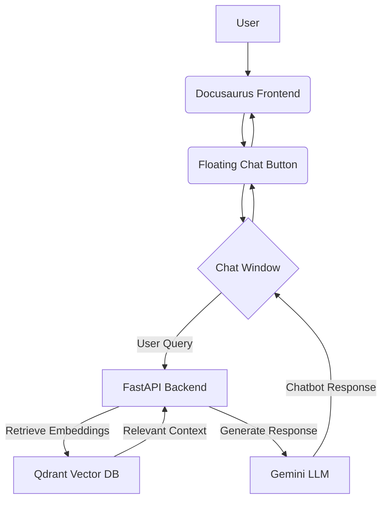

# RAG Chatbot Integration for Docusaurus Physical AI & Humanoid Robotics Book

## 1. Problem Definition

Users of the Docusaurus-based "Physical AI & Humanoid Robotics" book lack an interactive way to query its content directly. They currently rely on manual searching, which can be time-consuming and inefficient for finding specific information or clarifying concepts. This leads to a suboptimal learning experience and potential frustration.

## 2. Feature Overview

This feature will integrate a RAG (Retrieval Augmented Generation) chatbot into the Docusaurus book. A floating chat button will be added to all pages, which, when clicked, will toggle a chat window. This chat window will allow users to ask questions about the book's content. The chatbot will be powered by a FastAPI backend utilizing the OpenAI Agents SDK, Gemini for language model capabilities, and Qdrant for vector search and embeddings. This integration aims to provide an intuitive and efficient way for users to interact with the book's knowledge base.

## 3. Functional & Non-Functional Requirements

### Functional Requirements

**Frontend (Docusaurus)**
*   **FR1.1**: A global floating button must be visible on all Docusaurus pages.
*   **FR1.2**: Clicking the floating button must toggle the visibility of a chat window.
*   **FR1.3**: The chat window must provide an input field for user queries and display chatbot responses.
*   **FR1.4**: The chat UI must be responsive and not interfere with Docusaurus navigation or theme.
*   **FR1.5**: The chat window must send user queries to the FastAPI backend at `/api/chat`.

**Backend (FastAPI + RAG + Qdrant + Gemini)**
*   **FR2.1**: The FastAPI application must expose a `/api/chat` endpoint to receive user queries.
*   **FR2.2**: The backend must process user queries using the OpenAI Agents SDK and Gemini.
*   **FR2.3**: The backend must utilize Qdrant for storing and retrieving document embeddings from the book's sitemap.
*   **FR2.4**: The backend must implement a RAG pipeline to retrieve relevant book sections before generating a response with Gemini.
*   **FR2.5**: The backend must return chatbot responses to the frontend.
*   **FR2.6**: The backend must support optional Cohere embeddings.

### Non-Functional Requirements

*   **NFR3.1**: **Performance**: Chatbot responses should be returned within 3-5 seconds for typical queries.
*   **NFR3.2**: **Reliability**: The chatbot service should have high availability, with minimal downtime.
*   **NFR3.3**: **Scalability**: The backend should be capable of handling a moderate number of concurrent users.
*   **NFR3.4**: **Security**: API keys and sensitive information must be stored securely and not exposed in the frontend or public repositories.
*   **NFR3.5**: **Maintainability**: The codebase should be well-structured, modular, and easy to understand for future enhancements.
*   **NFR3.6**: **Usability**: The chat interface should be intuitive and user-friendly.

## 4. Architecture & Data Flow

**High-Level Architecture:**



**Data Flow:**

1.  User interacts with the Docusaurus frontend.
2.  User clicks the floating chat button, opening the chat window.
3.  User types a query into the chat window and sends it.
4.  The Docusaurus frontend sends the user query to the FastAPI backend at `/api/chat`.
5.  The FastAPI backend receives the query.
6.  The backend queries the Qdrant Vector Database to retrieve document embeddings and relevant context from the book based on the user's query.
7.  The retrieved context is augmented with the user's query and sent to the Gemini LLM.
8.  Gemini generates a response based on the provided context and query.
9.  The FastAPI backend sends the Gemini-generated response back to the Docusaurus frontend.
10. The chat window displays the chatbot's response to the user.

## 5. Folder Structure

```
00-my-research-papar/
├── physical-ai-and-humanoid-robotics/
│   ├── ... (Docusaurus files)
│   ├── src/
│   │   ├── components/
│   │   │   └── ChatbotButton.tsx
│   │   │   └── ChatbotWindow.tsx
│   │   └── theme/
│   │       └── ToggledarkMode.js (Example for theme integration if needed)
│   └── rag-chatbot/
│       ├── my_config/
│       │   └── gemini_config.py
│       ├── my_agent/
│       │   └── course_agent.py
│       ├── routers/
│       │   └── chat.py
│       ├── rag/
│       │   ├── ingest.py
│       │   └── retrieve.py
│       ├── main.py
│       └── .env.example
├── specs/project-rag-working-chatbot/
│   ├── spec.md
│   ├── plan.md
│   └── tasks.md
└── ... (Other project files)
```

## 6. Backend Services

*   **FastAPI**: Provides the RESTful API endpoint for the chatbot.
*   **OpenAI Agents SDK**: Orchestrates the interaction between the LLM, retrieval system, and other tools.
*   **Gemini (via AsyncOpenAI)**: The large language model responsible for generating human-like responses.
*   **Qdrant**: A vector database used for efficient storage and retrieval of document embeddings.
*   **Cohere (Optional)**: Can be used as an alternative or additional embedding model.

## 7. Embedding + RAG Pipeline

1.  **Ingestion (`rag/ingest.py`)**:
    *   The `rag/ingest.py` script will be responsible for fetching the sitemap from `https://giaic-hackathon-book-rag-2025.vercel.app/sitemap.xml`.
    *   It will parse the sitemap to extract URLs of the book's content pages.
    *   For each content page, it will fetch the content, clean it (e.g., remove HTML tags, navigation elements), and split it into manageable chunks.
    *   Each chunk will be embedded using an embedding model (e.g., Cohere or a model compatible with `openai-agents`).
    *   These embeddings and their corresponding text chunks will be stored in Qdrant.

2.  **Retrieval (`rag/retrieve.py`)**:
    *   When a user query is received, it will be embedded using the same embedding model used during ingestion.
    *   The embedded query will be used to perform a similarity search in Qdrant to retrieve the top-k most relevant document chunks from the book.

3.  **Generation (via `my_agent/course_agent.py`)**:
    *   The retrieved document chunks (context) will be combined with the user's original query.
    *   This combined prompt will be sent to the Gemini LLM (via `my_config/gemini_config.py` and `AsyncOpenAI`) to generate an informed response.

## 8. Agent Configuration

**`my_config/gemini_config.py`**:

```python
from openai import AsyncOpenAI

# Environment variables will be loaded from .env
# QDRANT_API_KEY, QDRANT_API_URL, GEMINI_API_KEY, GEMINI_BASE_URL, COHERE_API

CLIENT = AsyncOpenAI(
    api_key=GEMINI_API_KEY,  # Replaced with actual env variable
    base_url=GEMINI_BASE_URL # Replaced with actual env variable
)

# Placeholder for actual model configuration, will be defined based on usage
# MODEL = OpenAIChatCompletionsModel(model="gemini-pro", client=CLIENT)

```

**`my_agent/course_agent.py`**:

This file will define the agent using the OpenAI Agents SDK. It will likely include:

*   Agent initialization with the configured Gemini model.
*   Tools for retrieval (e.g., calling `rag/retrieve.py`).
*   Logic to process user queries, utilize retrieval, and generate responses.

## 9. Frontend Integration

*   **Component Creation**: Two main React components will be created in `physical-ai-and-humanoid-robotics/src/components/`:
    *   `ChatbotButton.tsx`: A small, floating button fixed to a corner of the screen.
    *   `ChatbotWindow.tsx`: A modal or slide-out panel containing the chat interface.
*   **Global Integration**: These components will be integrated into the Docusaurus layout, likely by modifying a theme swizzle or a global layout component, to ensure they are present on all pages.
*   **Styling**: Custom CSS in `physical-ai-and-humanoid-robotics/src/css/custom.css` will ensure consistent theming and positioning.

## 10. Security & Deployment Considerations

*   **API Key Management**: All API keys (Qdrant, Gemini, Cohere) must be stored as environment variables and never hardcoded. These should be loaded securely by the backend application.
*   **CORS**: The FastAPI backend must be configured with appropriate CORS (Cross-Origin Resource Sharing) policies to allow requests only from the Docusaurus frontend domain.
*   **Rate Limiting**: Implement rate limiting on the `/api/chat` endpoint to prevent abuse and ensure fair usage.
*   **Input Validation**: All user inputs to the chatbot must be validated to prevent injection attacks or malformed requests.
*   **Deployment**: The FastAPI backend can be deployed as a separate service (e.g., on Vercel, Render, AWS Lambda, Google Cloud Run). The Docusaurus frontend will be deployed statically as usual.
*   **HTTPS**: Ensure all communication between frontend and backend is over HTTPS.

## 11. Environment Variables

The following environment variables are required for the backend:

*   `QDRANT_API_KEY`: API key for Qdrant service.
*   `QDRANT_API_URL`: URL for Qdrant service.
*   `GEMINI_API_KEY`: API key for Gemini LLM.
*   `GEMINI_BASE_URL`: Base URL for the Gemini API (e.g., Google AI Studio endpoint).
*   `COHERE_API`: API key for Cohere (if used for embeddings).

These will be stored in a `.env` file in the `rag-chatbot/` directory, as indicated by `.env.example`.

## 12. API Contract (JSON Input/Output)

### Request (Docusaurus Frontend to FastAPI Backend)

**Endpoint**: `POST /api/chat`

**Content-Type**: `application/json`

```json
{
  "message": "What is humanoid robotics?"
}
```

### Response (FastAPI Backend to Docusaurus Frontend)

**Content-Type**: `application/json`

```json
{
  "response": "Humanoid robotics is a field of robotics dedicated to creating robots with a body structure similar to that of the human body. These robots are designed to mimic human motion and interaction with the environment.",
  "sources": [
    "https://giaic-hackathon-book-rag-2025.vercel.app/docs/chapter1/introduction-to-humanoid-robotics"
  ]
}
```

*Note: The `sources` field is optional and will contain relevant URLs from the book if retrieved during the RAG process.*
